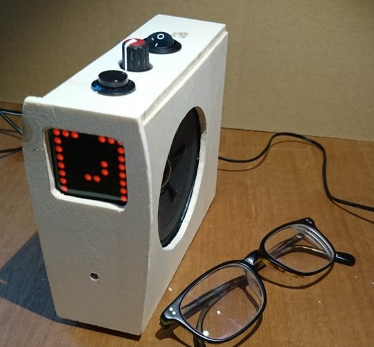

# ElBanquos_AlarmClock
An Arduino based radio alarm clock with a unique display method and an efficient user interface

* [Bedienungsanleitung (German Manual)](https://mattywausb.github.io/ElBanquos_AlarmClock/docs/manual-de.html)
* [Manual](https://mattywausb.github.io/ElBanquos_AlarmClock/docs/manual-en.html)

# Introduction
Actual alarm clocks are often not designed very well, because they try to be cheap and very multifunctional.
I want to create an alarm clock, that is optimized by enhanceing the essential features an reducing all gimmicks not necessary for the job.

Essential functions of a radio alarm clock
* show the actual time (in a good adapted brightness)
* Play radio to wake me up (fading it smothly in)
* efficient and reliable change of alarm time
* ensure correct volume of sound (minimize risk of silent alarm due to bad volume controller)
* Get correct time through available broadcast services (RDS is best, since we need a radio module anyway)
* Snooze function
* "Hard to Kill" alarm off procedure (Procedure needs more then just hitting a button)
* Switch bewteen alarm mode and non alarm mode
* stop bothering after (1?) Hour

Personal essential feature
* show time in a pattern, a short sighted person still can recognize over 2 meters 
* Nap function (Wake me up after a defined interval)

Nice to have functions
* Sleep function - Play Radio on demand for a defined time and fade it out smoothly

Further extentions
* Dim up light to simulate sunrise before starting the radio

Unecessary function
* Play radio for endless time
* Change radio stations (I always wake up with the same)
* Show Radio Station name
* shot weather and other data etc.

# Repository content
In the repository you will find all necessary code and diagrams to build the clock by yourself
* Arduino sketch including
** Display programming
** Encoder reading
** RDS Data cleansing procedure
** "EEPROM Database" class for easy storing data on EEPROM
* Fritzing circuit plan (not full PCB layout, since I just build on prototype boards)
** Also provided as png export
* Manuals and design approach
* Rough skecth to build a housing
* [List of Parts](https://mattywausb.github.io/ElBanquos_AlarmClock/docs/listofparts.html)

# Tools you need
* Arduino IDE
* Frizing
* inkscape (or some other svg tool to read the building sketches)

