# El Banquos Alarm Clock - Manual

Sinc I could not find a sutable alarm clock in the stores I decided to build my own with the following features:
* easy adjustable alarm time
* fading volume when alarm starts
* compact display design that is readable by shortsighted person (me)
* adjusted and display brightness that can not be noticed with closed eyes
* self adjusting time by using radio data signal
* nap function for taking a shot nap at daytime independendtly from alarm setting
* deactivating alarm cannot be an accident
* Radio station and Volume cannot be changed by accident

To be translated later:
----

# Bestandteile des Weckers
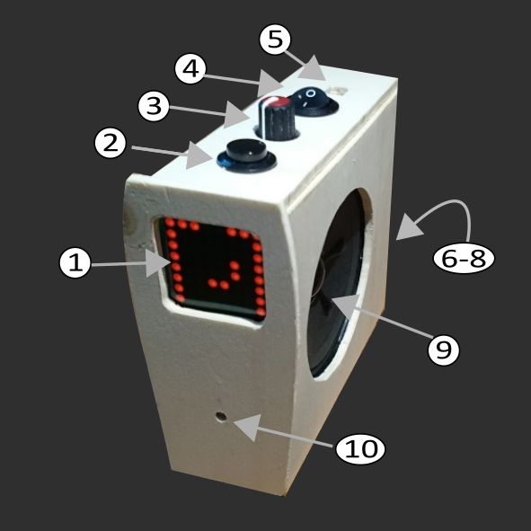
1. 8x8 LED Punkmatrix Display zur Anzeige aller Informationen
2. Schlummer Taste
3. Drehregler und Taste Einstellung und Bestätigung verschiedener Funktionen
4. Weckfunktionschalter 
5. USB Port des Arduino für Softwareupdates
6. "Wurfantenne"
7. Lauststärkeregler
8. Kabelausgang zum Netzteil
9. Lautsprecher
10. Lichtsensor

# Inbetriebnahme und Schnellstart
1. Wecker an das Stromnetz anschließen -> Auf dem Display erscheit kurz ein "Bestätigungssymbol" und danach die "Zeitsuchanzeige". Der Wecker 
wartet nun auf Zeitinformationen im Radiosignal. Da diese nur 1 mal pro Minute gesendet werden und der Wecker
außerdem mindestens auf 10 plausible Werte waret, wird dieser Vorgang mindestens 10 Minuten dauern. Trotzdem kann jetzt schon die Weckzeit eingestellt werden
2. Einstellen der Weckzeit einleiten durch einmaliges Drücken auf den Drehschalter
3. Drehregler vor- oder zurückdrehen bis die gewünschte Weckzeit angezeigt wird (siehe gleich, lesen der Zeitanzeige)
4. Drehregler drücken um die gewählte Zeit als Weckzeit zu speichern -  Auf dem Display erscheit kurz ein "Bestätigungssymbol" 
und danach die Zeitanzeige bzw. die Zeitsuchanzeige
5. Weckfunktionschalter auf 1 stellen  -> In der Zeitanzeige wird der Status entsprechend angezeigt.

Der Wecker schaltete sich nun zu der gesetzten Uhrzeit ein.
* Um den Alarm für 10 Minuten zu pausieren, Schlummer Taste drücken -> Radio geht aus, Im Display blinken zwei Punkte. Das Radio schaltet sich nach 10 Minuten wieder an
* Um den Alarm abzustellen, den Drehregler drehen-> Auf dem Display wird mit der Drehbewegung ein Quadrat gezeichnet. 
Hat man weit geng gedreht um das Quadrat zu komplettieren, wird der Alarm beendet
* Um zu verhindern, das der Alarm am nächsten Tag erneut aktiv wird, muss der Alarmschalter auf 0 gestellt werden.

Hinweis: Ein aktiver Alarm wird durch abschalten des Weckfunktionschalters nicht beendet. Dazu ist die beschriebene Prozedur  mit dem Drehregler notnwedig
Alternativ schaltet sich das Radio nach 1 Stunde automatisch ab.

# Die Uhrzeitanzeige
Die Zeitanzeige wurde so gestaltet, dass sie in der Nacht auch von einem kurzsichtigen Menschen ohne Brille mit moderatem Abstand gelesen werden kann. 
Sie ist deshalb mit einfachen Linienmustern konzipiert, die für alle Zeiteinheiten gut differenzierbar sind. 

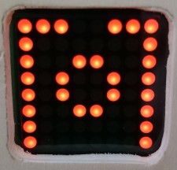

Die Anzeige teilt sich in zwei Elemente:
* Stundenrahmen (mit einer 1 Stunden und 3 Stunden Lücke)
* Viertelstundenkreis
Da die Zeit insgesamt mit einer Genauigkeit von nur 15 Minuten angezeigt wird, ist sie gegenüber der präzisen Zeit um 5 Minuten
vorversetzt, d.h. die volle Stunde wird 5 Minuten vor dem erreichen der vollen Stunde angezeigt. 
Der gleiche Versatz für alle weiteren Abschnitte der Stunde. (Dieser Verstatz gilt nur für die Echtzeitanzeige. Die Einstellung der Alarmzeit hat eine exakte Anzeige)
## Der Stundenrahmen
Der Stundenrahmen wird am äußeren Rand des Displays angezeigt. Eine kleine Lücke aus 2 Punkten zeigt die aktuelle Stunde an, analog wie bei einer Zeigeruhr (12 Uhr oben mittig, 3 uhr rechts mittig usw).

Ab 20 Minuten vor der Folgestunde rückt diese Lücke um ein Punkt vor, um die relative Nähe
zur kommenden Stunde anzuzeigen. 

Die Rahmenkante gegnüber der Stundenlücke wird komplett offen gelassen (große Lücke). Dadurch ist eine sehr grobe Einschätzung der Zeit ohne Erkennen der kleinen Lücke möglich. Gerade die allgemein "weckkrittischen" Stunden 5-7 Uhr sind damit gut von den davor liegenden Stunden 11-1 und 2-4 unterscheidbar.

Solange der Alarm über den Schalter **abgeschaltet** ist, wird dies durch **zwei Lücken** in den "seitlichen" Rahmenkanten erkennbar gemacht.
## Viertelstundenkreis
In der Mitte des Displays wird der Fortschritt innerhalb einer Stunde in 15 Minutenschritten angezeigt.
* -5 Minuten bis + 5 Minuten zur vollen Stunde: Voller kreis
* 5 Minuten- 10 Minuten: keine Markierung in der Mitte
* 10 - 25 Minuten: 2 Pixel rechts der Mitte
* 25-40 Minuten: zusätzlich 2 Pixel unterhalb der Mitte
* 40-55 Minuten: zusätzlich 2 Pixel links der Mitte
## Beispiele
|Display|Zeit   |Display|Zeit    |
|-------|-------|-------|--------|
|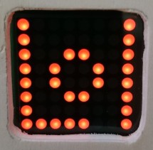| 5:00 Uhr|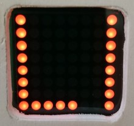| 5:05 Uhr|
|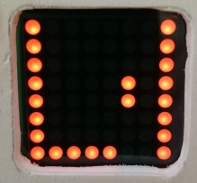| 5:15 Uhr|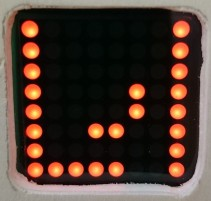| 5:30 Uhr|
|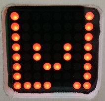| 5:45 Uhr|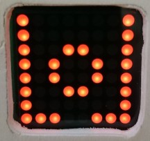| 6:00 Uhr|

# Die Weckzeitanzeige
Die Weckzeitanzeige ist ähnlich wie die Uhrzeitanzeige abzulesen. Es gibt folgende Unterschiede:
* Minuten werden in mit einem kleinen Quadreat(4x4) in der Mitte des Displays dargestellt. Jeder Punkt des Quardrates steht für 5 Minuten. Der volle Kreis steht für die volle Stunde.
* Uhrzeiten am Nachmittag und Abend  (12-23 Uhr) werden durch einen ausgefüllten Mittelpunkt der Anzeige kenntlich gemacht.
* Die sonst offene Kante des Stundenrahmens ist geschlossen (Anzeige der Weckzeit) oder blinkt (Einstellung der Weckzeit)
* Die angezeigte Zeit entspricht exakt dem Wert, der gerade gewählt wurde.
## Beispiele
|Display|Weckzeit   |Display|Weckzeit    |
|-------|-------|-------|--------|
|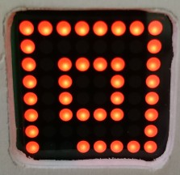| 7:00 Uhr|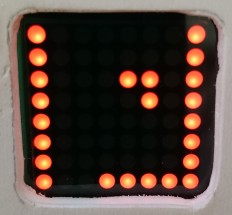| 07:15 Uhr|
|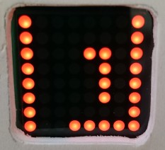| 7:25 Uhr|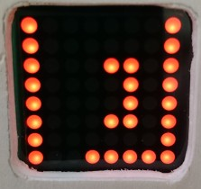| 07:30 Uhr|

# Bedienung

## Weckzeit anzeigen
Wenn sich das der Wecker im Ruhezustand befindet (Anzeige der Uhrzeit, keine laufender Alarm) kann man sich die eingestellte Weckzeit wie folgt anzeigen lassen:
1. Drehregler drehen -> Die Weckzeit wird angezeigt, nach einer kurzen Wartezeit springt die anzeige selbständig zurück auf die Uhrzeit

Alternativ kann mit der Schlummer Taste unverzüglich auf die Uhrzeit zurückgeschaltet werden

## Weckzeit stellen
Wenn sich der Wecker im Ruhezustand befinden (Anzeige der Uhrzeit oder Weckzeit, kein laufender Alarm) kann die Weckzeit wie folgt eingestellt werden:
1. Drehregler drücken -> Die Weckzeit wird angezeigt, wobei die offene Kante des Stundenrahmens blinkt
2. Drehregler vor oder zurückdrehen bis die gewünschte Weckzeit angezeigt wird 
3. Drehregler drücken oder 10 Sekunden keine Bedienung vornehmen um die gewählte Zeit als Weckzeit festzulegen-->  Auf dem Display erscheint kurz ein "Bestätigungssymbol" und danach die Zeitanzeige bzw. die Zeitsuchanzeige

Alternativ kann mit dem Schlummer Taste die Änderung der Weckzeit abgebrochen werden.

## Weckfunktion ein/ausshalten
Die grundsätzliche Aktivierung der Weckfunktion erfolgt mit dem Weckfunktionschalter. Damit der Alarm bei Erreichen der Weckzeit aktiviert wird, muss dieser Schalter auf "1" gestellt sein. Ist er auf "0" gestellt und der Alarm damit deaktiviert, wird dies durch zwei kleine Lücken in den seitlichen Kanten des Stundenrahmens im Display angezeigt.
Alarm an: 
Alarm aus: 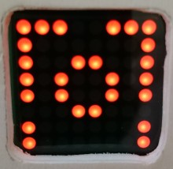

**ACHTUNG:** Ein laufender Alarm wird durch das Auschalten nicht beendet.
Die "Nickerchen" Funktion arbeitet unabhängig von der Position des Alarmschalters.

## Alarm pausieren ("Schlummer")
Wenn das Radio aufgrund des erreichens der Alarmzeit eingeschaltet wurde, kann man den Alarm pausieren:
1. Schlummer Taste betätigen -> Das Radio wird abgeschaltet und nach 10 Minuten erneut aktiviert. Während der "Schlummerphase" blinken zwei Punkte in der offenen Kante der Uhrzeitanzeige.

## Aktuellen Alarm beenden
Um einen laufenden  oder pausierten Alarm zu beenden:
1. Drehregler drehen-> Auf dem Display erscheint Quadrat mit einem Mittelpunkt
2. Drehregler weiter drehen bis das Quadrat verschwunden ist -> der Alarm wird beendet

## Nickerchenfunktion
Für ein Nickerchen, kann der Wecker unabhängig von der Weckzeit auf ein Intervall eingestellt werden, nach dem er dann die Weckfunktion aktiviert.
1. Schlummer Taste drücken -> Auf dem Display erscheint ein  "Minutenquadrat", voreingestellt auf 20 Minuten(=4 Punkte) (Be schon laufender Nickerchenfunktion wird die verbleibenden Restzeit angezeigt)
2. Mit dem Drehregler kann die Dauer in 5 Minutenschritten zwischen 0 und 120 Minuten(großes komplettes Quadrat) geändert werden 
3. Mit drücken auf den Drehregler (oder aber nach 10 Sekunden ohne Bedienhandlung) wird die gewählte Dauer bestätigen -> Bestätigtungshaken erscheint und danach die Uhrzeit wobei zwei Punkte in der offenen Kante des Stundenrahmens blinken

Der Wecker alarmiert nach Ablauf der eingestellten Zeit.

## Nickerchenfunktion ausschalten
Um eine laufende Nickerchenfunktion abzuschalten
1. Drehregler drehen-> Auf dem Display erscheint mit der Drehbewegung ein Quadrat 
2. Drehregler weiter drehen bis das Quadrat komplettiert ist ->  die Nickerchenfunktion wird abgeschaltet (identisch mit Alarm beenden)

Alternativ;
1. Schlummer Taste drücken -> Auf dem Display erscheint ein  "Minutenquadrat",  mit der noch verbleibenden Laufzeit
2. Mit dem Drehregler die Zeit auf 0 verringern
3. Mit drücken auf den Drehreger wird die Nickerchenfunktion abgeschaltet.

## Einschlaffunktion / Radio an
Über die Schlaffunktion kann das Radio spontan für eine definierte Zeit eingeschaltet werden.
1. Schlummer Taste drücken --> Auf dem Display erscheint ein  "Minutenquadrat", voreingestellt auf 20 Minuten für ein Nickerchen
2. Mit dem Drehregler die Dauer verringern und über den Nullpunkt drehen-> das Radio schaltet sich ein.
3. Durch Weiterdrehen kann die Einschaltdauer in 5 Minutenschritten geändert werden 
4. Mit Drücken auf den Drehregler die gewählte Dauer bestätigen -> Das Radio wird sich nach Ablaufen der Dauer abschalten

Alternativ: Wird nach der Anpassung der Zeit keine weitere Bedienung vorgenommen, wird die angezeigte Zeit als Laufzeit übernommen

## Einschlaffunktion / Radio abschalten
Wenn das Radio über die Schlaffunktion aktiviert wurde, kann es wie folgt abgeschaltet werden:
1. Schlummer Taste drücken -> Auf dem Display erscheint das  "Minutenquadrat, mit der Restzeit der Schlaffunktion
2. Schlummer Taste drücken -> die Schlaffunktion wird abgeschaltet

# Zeitsuchanzeige
Die Zeitinformation im RDS Signal ist störanfällig und bedarf einer längeren Prüfung bevor sie vertrauenswürdig ist. Die Zeitsuchanzeige wird angezeigt, solange der Wecker nach dem Einschalten keine zuverlässige Uhrzeitinformation besitzt.
Sie besteht aus folgenden Elementen:
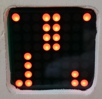
* Linker Balken von unten nach oben: Empfangsstärke des laufenden Senders 
* Mittlerer Balken von oben nach unten: Vertrauen in den aktuell empfangenden RDS Wert (Wenn dieser Balken den unteren Displayrand erreicht, wurden genügen Informationen gesammelt um die Uhrzeit zu übernehmen) 
* Rechter Balken von unten nach oben: Vertrauen in die aktive Uhrzeit

Die Uhr übernimmt die aktuelle  RDS Uhrzeit nur dann, wenn sie das gleiche oder bessere Vertrauen in die RDS zeit als in die laufende Uhrzeit hat. Zu Sommer/Winterzeitumstellung werden 20 korrekte Messungen benötigt, bis die neue Uhrzeit in das System übernommen wird. Eine Weckzeit zwischen 3:00 und 3:20 in der Winterzeitumstellung wird daher nicht korrekt erkannt.

# Verhalten bei einem Neustart
Ein Neustart der Uhr erfolgt
* Nach einem Stromausfall
* bei internen Reboot aufgrund eines nicht behebbaren Fehlers

Die Weckzeit sowie ein laufender Alarm oder Nickermodus werden von der Uhr im Festwertspeicher gemerkt und beim Neustart wieder ausgelesen. Sowie die Uhr wieder aktiv ist nutzt sie diese Information um ggf. unverzüglich einen Alarm zu aktivieren wenn

* (noch zu implementieren) Der Schlummermodus war aktiv
* Eine "Nickerchenzeit" gesetzt war
* Zeit über RDS als korrekt bewertet wurde und die eingestellte Weckzeit weniger als 60 Minuten her ist 

# Sender Preset auswählen
Das Radio hat 4 Senderpresets, die auch bei der Suche der RDS Zeit durchsucht werden. Die Fequenzen sind direkt im Code hintelegt. Das Preset, das zum Wecken benutzt wird, kann wie folgt ausgewählt werde,
1. Schlummer Taste drücken -> Auf dem Display erscheint das  "Minutenquadrat, mit der Restzeit der Schlaffunktion oder Nickerchenfunktion"
2. Mit dem Drehregler die Zeit über den größten Wert hinaus drehen bis ein "P" auf dem Display erscheint.
3. Drehregler drücken-> Presetauswahlmodus wird gestartet
4. Mit dem Drehregler das gewünschte Preset auswählen

Zusatz: Mit der Schlummer Taste kann das Radio in diesem Modus ein und ausgeschaltet werden.

# Diagnosefunktion(Trace)
Um die Funktionstüchtigkeit des Weckers zu beurteilen, können über die Trace Funktion interne Werte der Uhr abgerufen werden.
1. Schlummer Taste drücken -> Auf dem Display erscheint das  "Minutenquadrat, mit der Restzeit der Schlaffunktion oder Nickerchenfunktion"
2. Mit dem Drehregler die Zeit über den größen Wert hinaus drehen bis ein "T" auf dem Display erscheint.
3. Drehregler drücken-> Diagnosemodus wird gestartet
4. Mit den Drehregler die gewünscht Diagnoseseite wählen
     1. Stundenwert der Uhr ( - -  wenn nocht keine Uhrzeit verfügbar ist)
     2. Minutenwert der Uhr ( - -  wenn nocht keine Uhrzeit verfügbar ist)
     3. Zeitsuchanzeige
     4. Empfangsstärke 
     5. 10er und 1 Ziffer der Frequenz des aktiven Senders
     6. Nachkommastellen der Frequenz des aktiven Senders
     7. Anzeige der Systemlaufzeit in "Binary Coded Decimal" (Zeile 8 Sekunden, Zeile 7 Minuten, Zeile 6 Stunden, Zeile 5 Tage). Die Systemlaufzeit beginnt nach ca. 50 Tagen von vorne bzw. nach jedem "Reboot".
     
Als weitere Diagnoseinformation Möglichkeit dient die LED auf dem Arduino Board, die bei geöffnetem Geäuse sichtbar wird. Diese wird synchron zum Radio ein und ausgeschaltet. Sollte also die LED leuchten, aber kein Ton zu hören sein, wären Laustärkeregler, Verstärker und Lautsprecher auf lose Kontakte zu prüfen.

# Demo Funktion
Um die Zeitanzeige besser kennenzulernen kann die Demofunktion genutzt werden:
1. Schlummer Taste drücken -> Auf dem Display erscheint das  "Minutenquadrat, mit der Restzeit der Schlaffunktion oder Nickerchenfunktion"
2. Mit dem Drehregler die Zeit über den größen Wert hinaus drehen bis ein "D" auf dem Display erscheint.
3. Drehregler drücken-> Demo Funktion wird gestartet und eine "Demo" Uhrzeit angezeigt

Die dem Drehregler kann die Uhrzeit geändert werden. Nach einer kurzen Zeit schaltet die Zeit auch selbstängig schnell vorwärts.
Wird länger keine Bedienung vorgenommen, wird wieder die Normalzeit angezeigt.

Mit der Schlummertaste kann die Demo Funktion aktiv beendet werden.

# Hintergründe für das Design
## Anzeige
Die übliche Anzeige mit Ziffern, hat den Nachteil, dass einige Zahlen nur schwer unterscheidbar sind, wenn man nicht über die komplette
Sehschärfe verfügt. So ist eine 5 schwer von eine 6 zu unterscheiden (was am Morgen den Unterschied zwischen Weiterschlafen und Panik 
ausmachen kann)
Analoge Uhrenziffernblätter sind diesbezüglich einfacher, haben aber immer noch das Problem der eindeutigen Orientierung. Eine leichte 
Kopfneigung kann aus einer 5:20  eine 4:15 machen (oder umgekehrt).
Das jetzige Konzept löst beide Probleme:
* Aufgrund der Quadratischen Form ist für eine Lageverwechslung eine Fehleinschätzung von 45 Grad notwendig
* Die Anzeige der Viertelstunden ist bietet von 15-35 Minuten eine zusätzliche Richtungsorientierung

Beim Ausprobieren verschiedener Darstellungen hat sich außerdem gezeigt, dass es unumgänglich ist, dem Nutzer immer eine Orientierung bzgl
der Gesamtgröße des Disyplays zu geben. Auch hat sich gezeigt, dass eine Unterbrechung von Linien immer 
zu Ableseproblemen führt. Daraus ergab sich am Ende der Ansatz mit dem Rahmen.

## Anordnung der Bedienelemente
* Die Hauptbedienelmente liegen oben und werden vertikal betätigt, damit der Wecker beim Betätigen nicht aus versehen verschoben wird bzw. mit einer zweiten Hand festgehalten werden muss
* der Lauststärkeregler liegt hinten, da er nach der optimalen Einstellung nicht aus Versehen verstellt werden soll
* Die Hauptbedienelmente liegen hintereinander, entsprechend ihrer Priorität der Nutzung beim Wecken. Schlummer zuerst, Alarmzeit einstellen und Alarm beenden als nächstes, Alarm aus/an als drittes

## Bedienungsabfolge
Die Bedienabfolge ist so gestaltet, dass die Bedienung beim zu Bett gehen(auch für ein Nickerchen) so wenig Geräusche wie möglich verursacht um "akustische Trigger", die den Körper wieder aufwecken, zu vermeiden.
Akustische Trigger sind: Drücken des Drehreglers, aktivierung des Radios. 

* Bedienungen ohne Geräusche: Alarmzeit anschauen, Nickerchenzeit setzen, Alarm pausieren, Alarm beenden
, Sender prüfen/ändern
* Bedienung mit 1 Klick: Alarmzeit ändern,Radiosender wählen

