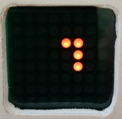

# El Banquos Alarm Clock - Manual

Since I could not find a suitable alarm clock in the stores I decided to build my own with the following features:
* easy adjustable alarm time
* fading volume when alarm starts
* compact display design that is readable by shortsighted person (me)
* adjusted and display brightness that can not be noticed with closed eyes
* self adjusting time by using radio data signal
* nap function for taking a shot nap at daytime independendtly from alarm setting
* deactivating alarm cannot be an accident
* Radio station and Volume cannot be changed by accident
# Elements of the clock

1. 8x8 LED Dot Matrix display
2. Snooze Button
3. Selection Knob
4. Wakeup function switch
5. USB port of the Arduino for Softwareupdates
6. Antenna cable
7. Volume Control
8. Cable to power supply
9. Speaker
10. Light sensor

# Quickstart
1. Plug in the Power Supply -> The Display should show a short "Acknowledge" Symbol and the clock will start with the rds data scanning display (more details on this later). Since rds time data is usially send only once a minute and the clock needs at least 10 consecutive plausible time telegrams, this will take at least 10 Minutes and will become  longer if the signal is weak or disturbed. Nevertheless it is possible to set the alarm time without having the correct time.
2. Start alarm time selection by pushing the selection knob(3) 
3. Turn the selection knob(3) to adjust the alarm time (how to read the display, see next chapter)
4. Push selection knob(3) to store the selected alarm time -> The Display shows a short "Acknowledge" Symbol 
5. Check that the Wakeup function switch (4) is set to 1

The alarm clock will play the radio at the given time.
* to pause the alarm for 10 minutes presse the Snooze Button(1) -> radio will switch of and indicate the snooze mode with two blinking dots.
* to stop the alarm turn the knob (3)->The display shows an outer and inner square. The outer square that starts disappearing while turning the knob. When the outer square is vanished, the alarm is stopped.

If there is no interaction for 60 minutes, the radio will stop playing by itself.

* to switch off the wake up function for the upcoming days, set the wakup function switch(4) to 0 

**Notice:** An active alarm or snoozed alarm will *not be stopped by switching the wakup function switch*. Only the "turning knob procedure" will stop the current alarm.

# Time display
The time display is designed to be even readable for moderate shortsighted persons when lying with the clock on the nightstand (1-2m). Since numerc digits (especially the crutial 5 and 6 in the morning) are hard to tell from each other the concept uses a pure graphical approach

The display consists of two elements:
* The hour frame (with a 1 hour indication gap and a 3 hour indication "counter gap")
* The quater hour circle
Since healthy waking up should be done in a more relaxed manner the time resolution is only 15 minutes and the display shows the current time five minutes in advance (e.g. it shows the 12:00 pattern already at 11:55). This offset is only used for the time display. Selection of alarm time and start of the alarm is at the precise moment. 

## The hour frame
The hour frame is displayed using the border of the matrix display. A small gap of 2 pixels indicates the current hour at the same position as known on analog watches. (12 at top, 3 at the mid of right side, 6 at bottom, 9 at the mid of the left side)
20 Minutes befor the upcoming next hour, the gap will move one pixel forward to indicate the progress.

Only the frame line with the gap an its neighbours are shown. Opposite line to the gap is not lit. So by only reading the orientation of the three lit lines of the frame it is possibile to distinguish the 3 hour blocks 11-1, 2-4, 5-7, 8-11. This provides roug readablity for even more distance.

### Wakup function switch indicator
When the wakup function is *switched off*, this will be indicated by placing a *one pixel gap* in each of the side lines. 

## Quater hour circle
The middle of the display is used to indicate the progess of time in one hour. This is done as follows:
* -5 minutes to 5 minutes to the whole hour: complete circle
* 5 minutes to 10 minutes: no marking in the middle
* 10 - 25 minutes: 2 Pixels right to the middle
* 25-40 minutes: additional 2 Pixel below the middle
* 40-55 minutes: additional 2 Pixel left to the middle
## Examples
|Display|Time   |Display|Time    |
|-------|-------|-------|--------|
|| 5:00 || 5:05 |
|| 5:15 || 5:30 |
|| 5:45 || 6:00 |

It takes 2 or 3 days to get used to it but then gets very intuitive.

# Alarm time display
The alarm time display is nearly similar to the time display with the following modifications:
* Minutes are displayed as 5 minutes per pixel in a inner square
* Hours between noon and midnoght (12-23 aka. p.m.) are indicated by lighint the for middle pixels in the display
* All four sides of the outer square are lit or flashing
* the time shown is the time chosen (no 5 minute offset)

## Examples
|Display|Time   |Display|Time    |
|-------|-------|-------|--------|
|| 7:00 || 07:15 |
|| 7:25 || 07:30 |

# Operations
A lot of "trivial"operations are not translated yet. Instead I focussed the special ones.

## Nap function
For taking a shot nap, you can set up an interval after the alarm will start. This function works independently of the normal alarm time and the wake up switch. To activate the nap function:

1. press snooze button(2) -> The display will show only an "Minute display" starting with 4 Pixel (20 minutes with 5 Minutes per pixel)
2. Turn the knob(3) to adjust the length of the interval in 5 minute steps. When turning over 1 hour, a second square will be drawn until you reach the maximum of 2 hours
3. Press the knob(3) (or leave the clock alone for 10 seconds) to activate the function -> after showing an acknowledgement the display will switch back to the normal Clock display but will additionalli  flash two pixels  to indicate the active nap function

The the time is up, the clock will start the normal alarm procedure (with snooze function and switch off procedure).

## Check / Change remaining nap time
To check the remaining nap time, when in nap function is active:
1. Press the snooze button-> Remaining nap time will be displayed
2. You may change the time by turning the knob

## Cancel nap function before alarm
Cancling the nap function is as easy as canceling the normal alarm (since it is internally a very long snooze mode).
1. turn the knob (3)->The display shows an outer and inner square. The outer square starts disappearing while turning the knob further. When the outer square is vanished, the nap function is stopped.

To be translated later:
----

# Bedienung

## Weckzeit anzeigen
Wenn sich das der Wecker im Ruhezustand befindet (Anzeige der Uhrzeit, keine laufender Alarm) kann man sich die eingestellte Weckzeit wie folgt anzeigen lassen:
1. Drehregler drehen -> Die Weckzeit wird angezeigt, nach einer kurzen Wartezeit springt die anzeige selbständig zurück auf die Uhrzeit

Alternativ kann mit der Schlummer Taste unverzüglich auf die Uhrzeit zurückgeschaltet werden

## Weckzeit stellen
Wenn sich der Wecker im Ruhezustand befinden (Anzeige der Uhrzeit oder Weckzeit, kein laufender Alarm) kann die Weckzeit wie folgt eingestellt werden:
1. Drehregler drücken -> Die Weckzeit wird angezeigt, wobei die offene Kante des Stundenrahmens blinkt
2. Drehregler vor oder zurückdrehen bis die gewünschte Weckzeit angezeigt wird 
3. Drehregler drücken oder 10 Sekunden keine Bedienung vornehmen um die gewählte Zeit als Weckzeit festzulegen-->  Auf dem Display erscheint kurz ein "Bestätigungssymbol" und danach die Zeitanzeige bzw. die Zeitsuchanzeige

Alternativ kann mit dem Schlummer Taste die Änderung der Weckzeit abgebrochen werden.

## Weckfunktion ein/ausshalten
Die grundsätzliche Aktivierung der Weckfunktion erfolgt mit dem Weckfunktionschalter. Damit der Alarm bei Erreichen der Weckzeit aktiviert wird, muss dieser Schalter auf "1" gestellt sein. Ist er auf "0" gestellt und der Alarm damit deaktiviert, wird dies durch zwei kleine Lücken in den seitlichen Kanten des Stundenrahmens im Display angezeigt.
Alarm an: 
Alarm aus: 

**ACHTUNG:** Ein laufender Alarm wird durch das Auschalten nicht beendet.
Die "Nickerchen" Funktion arbeitet unabhängig von der Position des Alarmschalters.

## Alarm pausieren ("Schlummer")
Wenn das Radio aufgrund des erreichens der Alarmzeit eingeschaltet wurde, kann man den Alarm pausieren:
1. Schlummer Taste betätigen -> Das Radio wird abgeschaltet und nach 10 Minuten erneut aktiviert. Während der "Schlummerphase" blinken zwei Punkte in der offenen Kante der Uhrzeitanzeige.

## Aktuellen Alarm beenden
Um einen laufenden  oder pausierten Alarm zu beenden:
1. Drehregler drehen-> Auf dem Display erscheint Quadrat mit einem Mittelpunkt
2. Drehregler weiter drehen bis das Quadrat verschwunden ist -> der Alarm wird beendet

## Einschlaffunktion / Radio an
Über die Schlaffunktion kann das Radio spontan für eine definierte Zeit eingeschaltet werden.
1. Schlummer Taste drücken --> Auf dem Display erscheint ein  "Minutenquadrat", voreingestellt auf 20 Minuten für ein Nickerchen
2. Mit dem Drehregler die Dauer verringern und über den Nullpunkt drehen-> das Radio schaltet sich ein.
3. Durch Weiterdrehen kann die Einschaltdauer in 5 Minutenschritten geändert werden 
4. Mit Drücken auf den Drehregler die gewählte Dauer bestätigen -> Das Radio wird sich nach Ablaufen der Dauer abschalten

Alternativ: Wird nach der Anpassung der Zeit keine weitere Bedienung vorgenommen, wird die angezeigte Zeit als Laufzeit übernommen

## Einschlaffunktion / Radio abschalten
Wenn das Radio über die Schlaffunktion aktiviert wurde, kann es wie folgt abgeschaltet werden:
1. Schlummer Taste drücken -> Auf dem Display erscheint das  "Minutenquadrat, mit der Restzeit der Schlaffunktion
2. Schlummer Taste drücken -> die Schlaffunktion wird abgeschaltet

# Zeitsuchanzeige
Die Zeitinformation im RDS Signal ist störanfällig und bedarf einer längeren Prüfung bevor sie vertrauenswürdig ist. Die Zeitsuchanzeige wird angezeigt, solange der Wecker nach dem Einschalten keine zuverlässige Uhrzeitinformation besitzt.
Sie besteht aus folgenden Elementen:

* Linker Balken von unten nach oben: Empfangsstärke des laufenden Senders 
* Mittlerer Balken von oben nach unten: Vertrauen in den aktuell empfangenden RDS Wert (Wenn dieser Balken den unteren Displayrand erreicht, wurden genügen Informationen gesammelt um die Uhrzeit zu übernehmen) 
* Rechter Balken von unten nach oben: Vertrauen in die aktive Uhrzeit

Die Uhr übernimmt die aktuelle  RDS Uhrzeit nur dann, wenn sie das gleiche oder bessere Vertrauen in die RDS zeit als in die laufende Uhrzeit hat. Zu Sommer/Winterzeitumstellung werden 20 korrekte Messungen benötigt, bis die neue Uhrzeit in das System übernommen wird. Eine Weckzeit zwischen 3:00 und 3:20 in der Winterzeitumstellung wird daher nicht korrekt erkannt.

# Verhalten bei einem Neustart
Ein Neustart der Uhr erfolgt
* Nach einem Stromausfall
* bei internen Reboot aufgrund eines nicht behebbaren Fehlers

Die Weckzeit sowie ein laufender Alarm oder Nickermodus werden von der Uhr im Festwertspeicher gemerkt und beim Neustart wieder ausgelesen. Sowie die Uhr wieder aktiv ist nutzt sie diese Information um ggf. unverzüglich einen Alarm zu aktivieren wenn

* (noch zu implementieren) Der Schlummermodus war aktiv
* Eine "Nickerchenzeit" gesetzt war
* Zeit über RDS als korrekt bewertet wurde und die eingestellte Weckzeit weniger als 60 Minuten her ist 

# Sender Preset auswählen
Das Radio hat 4 Senderpresets, die auch bei der Suche der RDS Zeit durchsucht werden. Die Fequenzen sind direkt im Code hintelegt. Das Preset, das zum Wecken benutzt wird, kann wie folgt ausgewählt werde,
1. Schlummer Taste drücken -> Auf dem Display erscheint das  "Minutenquadrat, mit der Restzeit der Schlaffunktion oder Nickerchenfunktion"
2. Mit dem Drehregler die Zeit über den größten Wert hinaus drehen bis ein "P" auf dem Display erscheint.
3. Drehregler drücken-> Presetauswahlmodus wird gestartet
4. Mit dem Drehregler das gewünschte Preset auswählen

Zusatz: Mit der Schlummer Taste kann das Radio in diesem Modus ein und ausgeschaltet werden.

# Diagnosefunktion(Trace)
Um die Funktionstüchtigkeit des Weckers zu beurteilen, können über die Trace Funktion interne Werte der Uhr abgerufen werden.
1. Schlummer Taste drücken -> Auf dem Display erscheint das  "Minutenquadrat, mit der Restzeit der Schlaffunktion oder Nickerchenfunktion"
2. Mit dem Drehregler die Zeit über den größen Wert hinaus drehen bis ein "T" auf dem Display erscheint.
3. Drehregler drücken-> Diagnosemodus wird gestartet
4. Mit den Drehregler die gewünscht Diagnoseseite wählen
     1. Stundenwert der Uhr ( - -  wenn nocht keine Uhrzeit verfügbar ist)
     2. Minutenwert der Uhr ( - -  wenn nocht keine Uhrzeit verfügbar ist)
     3. Zeitsuchanzeige
     4. Empfangsstärke 
     5. 10er und 1 Ziffer der Frequenz des aktiven Senders
     6. Nachkommastellen der Frequenz des aktiven Senders
     7. Anzeige der Systemlaufzeit in "Binary Coded Decimal" (Zeile 8 Sekunden, Zeile 7 Minuten, Zeile 6 Stunden, Zeile 5 Tage). Die Systemlaufzeit beginnt nach ca. 50 Tagen von vorne bzw. nach jedem "Reboot".
     
Als weitere Diagnoseinformation Möglichkeit dient die LED auf dem Arduino Board, die bei geöffnetem Geäuse sichtbar wird. Diese wird synchron zum Radio ein und ausgeschaltet. Sollte also die LED leuchten, aber kein Ton zu hören sein, wären Laustärkeregler, Verstärker und Lautsprecher auf lose Kontakte zu prüfen.

# Demo Funktion
Um die Zeitanzeige besser kennenzulernen kann die Demofunktion genutzt werden:
1. Schlummer Taste drücken -> Auf dem Display erscheint das  "Minutenquadrat, mit der Restzeit der Schlaffunktion oder Nickerchenfunktion"
2. Mit dem Drehregler die Zeit über den größen Wert hinaus drehen bis ein "D" auf dem Display erscheint.
3. Drehregler drücken-> Demo Funktion wird gestartet und eine "Demo" Uhrzeit angezeigt

Die dem Drehregler kann die Uhrzeit geändert werden. Nach einer kurzen Zeit schaltet die Zeit auch selbstängig schnell vorwärts.
Wird länger keine Bedienung vorgenommen, wird wieder die Normalzeit angezeigt.

Mit der Schlummertaste kann die Demo Funktion aktiv beendet werden.

